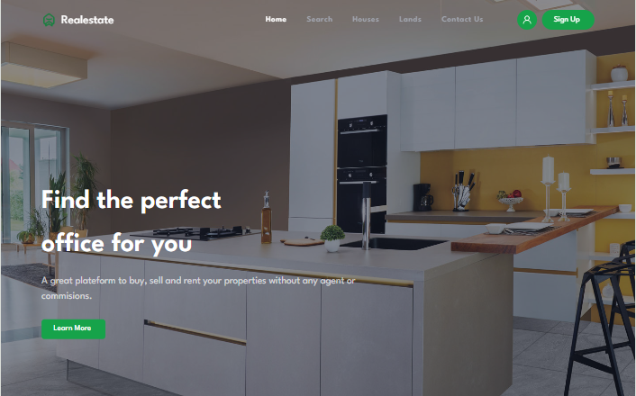
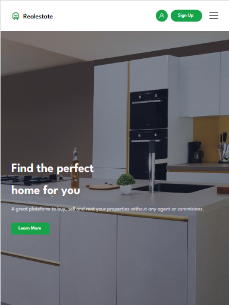

# Real Estate Landing Page — React & Bootstrap 5

A modern, fully responsive real estate landing page built with **React**, **Bootstrap 5**, and **styled-components**. This project demonstrates practical frontend skills including component-driven architecture, responsive design, and Firebase integration for authentication and data storage.

---

## Live Demo

Explore the live site here:  
[https://realestate-copy.vercel.app/](https://realestate-copy.vercel.app/)

---

## Features

- Responsive design optimized for desktop, tablet, and mobile devices  
- Utilizes Bootstrap 5 grid and utility classes for efficient layout  
- Styled-components for scoped, maintainable CSS  
- React functional components with hooks for state management  
- Firebase Authentication for secure user sign-in/sign-out  
- Contact form connected to Firebase Firestore for message persistence  

---
### About Me
Mejba Hasan — 

Portfolio: https://mejba-hasan-portfolio.vercel.app/

LinkedIn: https://www.linkedin.com/in/mejbahasan/

GitHub: https://github.com/codermejba

---
## Technology Stack & Dependencies

| Package             | Purpose                                  | Version          |
|---------------------|------------------------------------------|------------------|
| react               | UI development and component management | ^18.2.0          |
| react-dom           | DOM rendering                            | ^18.2.0          |
| react-router-dom    | Client-side routing                      | ^7.6.0           |
| react-hook-form     | Form handling and validation             | ^7.56.4          |
| bootstrap           | Responsive layout and styling            | ^5.3.2           |
| @popperjs/core      | Tooltip & popover positioning for Bootstrap | ^2.11.8       |
| styled-components   | CSS-in-JS styling                        | ^6.1.8           |
| firebase            | Authentication and Firestore database    | ^11.8.1          |
| react-slick         | Carousel component                       | ^0.30.3          |
| slick-carousel      | Carousel styles                          | ^1.8.1           |

**Dev Dependencies**

| Package               | Purpose                                  | Version          |
|-----------------------|------------------------------------------|------------------|
| vite                  | Build tool and dev server                 | ^6.3.5           |
| @vitejs/plugin-react  | React plugin for Vite                     | ^4.2.1           |
| eslint                | Linting utility                           | ^8.55.0          |
| eslint-plugin-react   | React linting rules                       | ^7.33.2          |
| eslint-plugin-react-hooks | React hooks linting rules             | ^4.6.0           |
| eslint-plugin-react-refresh | React Refresh linting                | ^0.4.5           |
| @types/react          | TypeScript typings for React (if used)  | ^18.2.43         |
| @types/react-dom      | TypeScript typings for React DOM (if used) | ^18.2.17       |

---

## Screenshots

Screenshots are located in the `/screenshots` directory.

| Mobile View                  | Desktop View                | Tablet / iPad View             |
|-----------------------------|-------------------------------|-----------------------------|
|  |  |  |

---

## Getting Started

### Prerequisites

- Node.js (v14+)  
- npm or yarn  
- Code editor (e.g., VS Code)

### Installation

```bash
git clone https://github.com/codermejba/RealestateCopy.git
cd RealestateCopy
npm install
npm run dev

