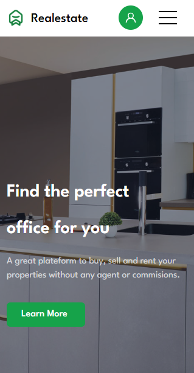

# 🏡 Real Estate Landing Page — Hously Clone (React + Bootstrap 5)

This project is a pixel-perfect clone of the **Hously Landing Page (index-six)**, originally built with Tailwind CSS. I rebuilt it using **React**, **Bootstrap 5**, and **styled-components** to sharpen my frontend development skills and gain real experience in layout replication, component structuring, and responsive design.

---

## 🔗 Live Demo

👉 [https://realestate-copy.vercel.app/](https://realestate-copy.vercel.app/)

---

## 🚀 Features

- 🔹 Fully responsive layout for all screen sizes  
- 🔹 Bootstrap 5 grid and utility classes  
- 🔹 Styled-components for scoped, reusable styling  
- 🔹 Component-based React architecture  
- 🔹 Clean and modern UI inspired by real-world design  
- 🔹 Firebase Authentication integration for user sign-in/sign-out  
- 🔹 Contact form with Firebase Firestore integration to save messages  

---

## 🛠️ Tech Stack

- ⚛️ **React**  
- ⚡ **Vite**  
- 🎨 **Bootstrap 5**  
- 💅 **Styled-components**  
- 🔐 **Firebase Auth & Firestore**  
- 🌟 **React Icons**  

---

## 📸 Screenshots

> Add your screenshots in the `screenshots/` folder of the repo.

### 🖥️ Desktop View  
  

### 📱 Mobile View  
  

### 📱 iPad / Tablet View  
  

---

## 📂 Getting Started

### 🧰 Prerequisites

- Node.js and npm  
- Code editor like VS Code  

### 🔧 Installation

```bash
git clone https://github.com/codermejba/RealestateCopy.git
cd RealestateCopy
npm install
npm run dev
